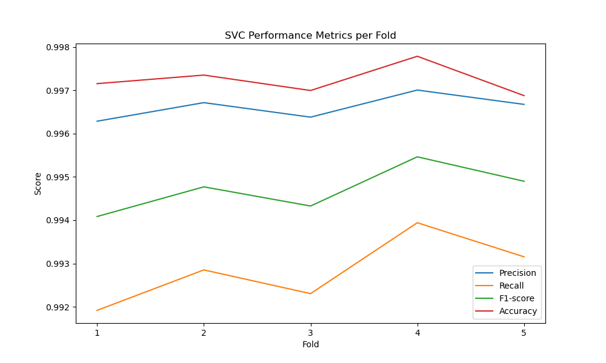
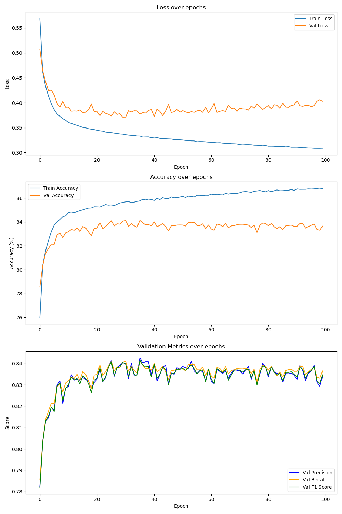
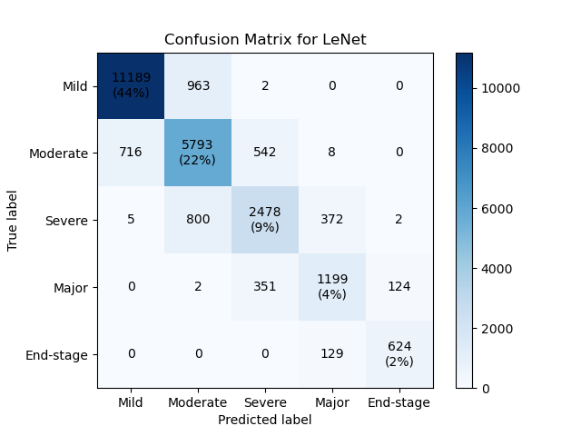
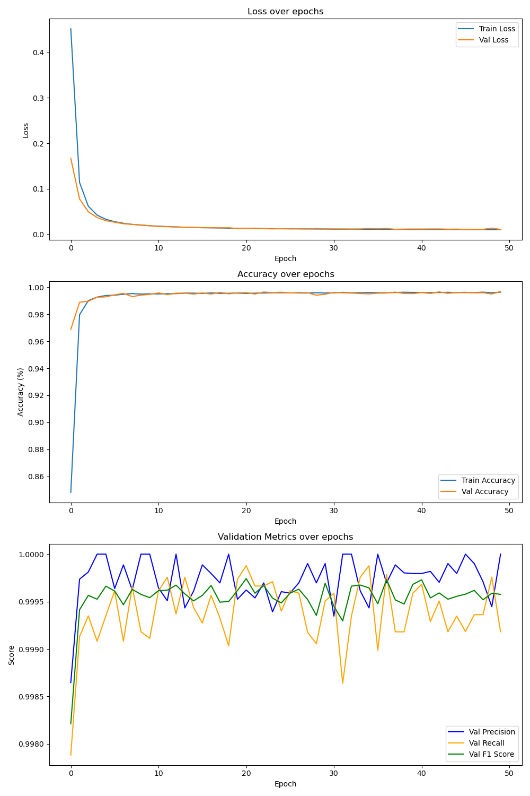
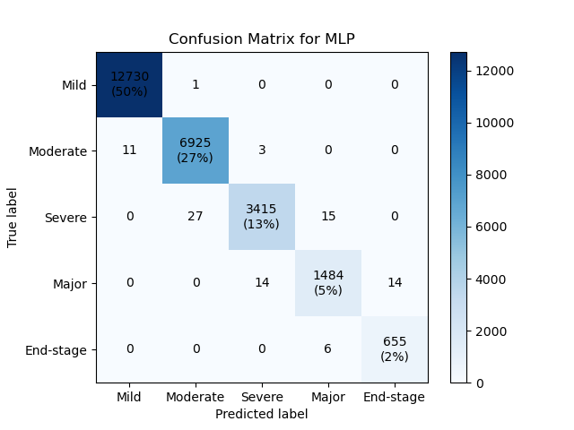

# Psychological Analysis System

## This section utilizes some models for classification

### The result of Support Vector Machine

1. Some metrics show the performance based on the Stratified K-Fold cross-validator

2. Confusion Matrix shows the resulting outcome of SVM after training 

### The result of LeNet

1. LeNet is a pioneering convolutional neural network (CNN) architecture, the plot below shows the training process of it

2. Confusion Matrix shows the resulting outcome of LeNet after training 

### The result of MLP

A **Multilayer Perceptron (MLP)** is a type of artificial neural network consisting of multiple layers of nodes (neurons) arranged in an input layer, one or more hidden layers, and an output layer. Each node in a layer is connected to every node in the next layer, and these connections have associated weights that are adjusted during training.

**Key Features:**
- **Feedforward Architecture**: Data flows in one direction, from input to output.
- **Activation Functions**: Non-linear functions (like ReLU, sigmoid, or tanh) are applied to the outputs of each node to introduce non-linearity.
- **Backpropagation**: A training algorithm that adjusts the weights based on the error of the output compared to the expected result, allowing the network to learn from data.

1. The plot below shows the training of it

2. Confusion Matrix shows the resulting outcome of MLP after training

MLPs are commonly used for tasks like classification and regression in supervised learning. According to the plots above, we can see that it works pretty well.