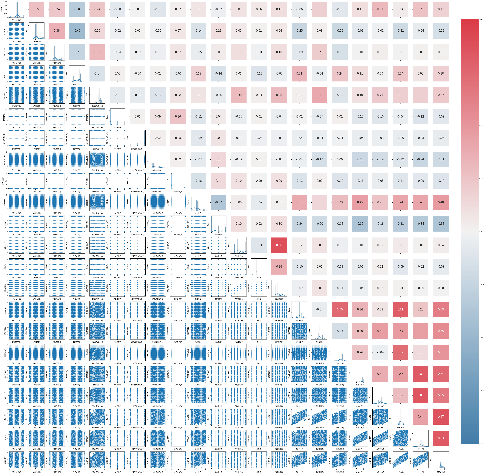
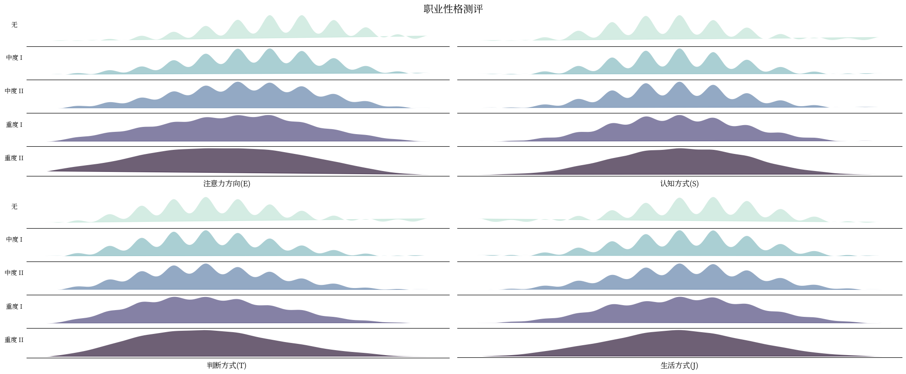
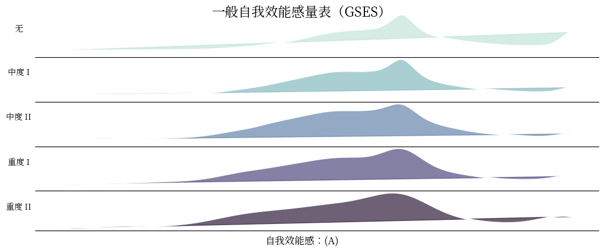
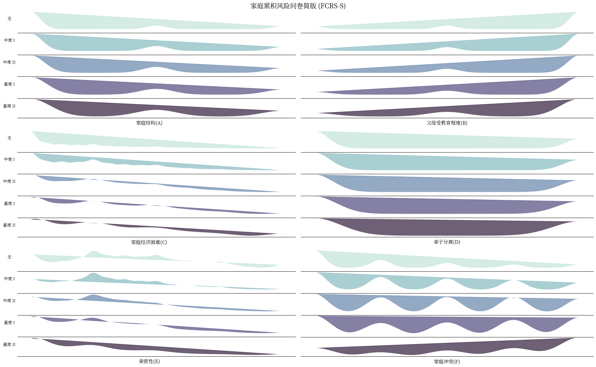
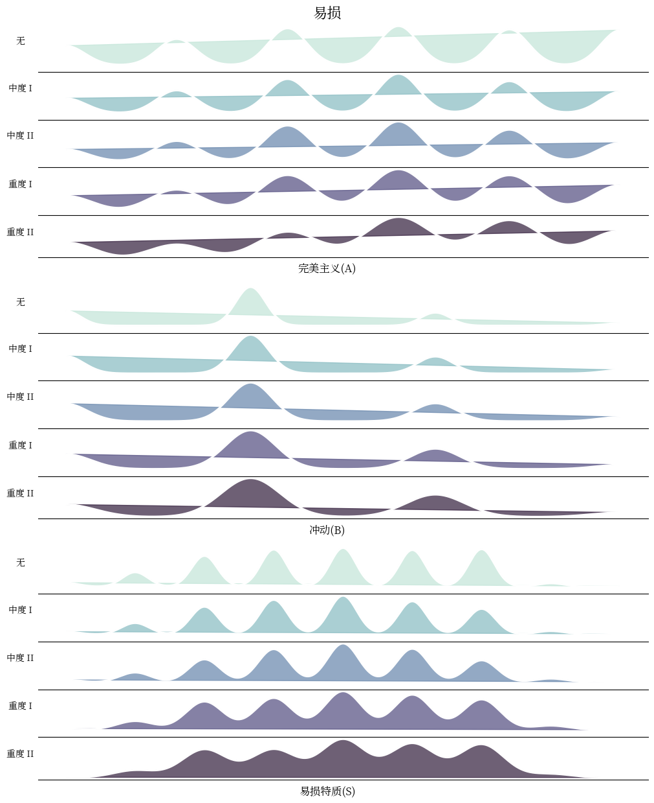
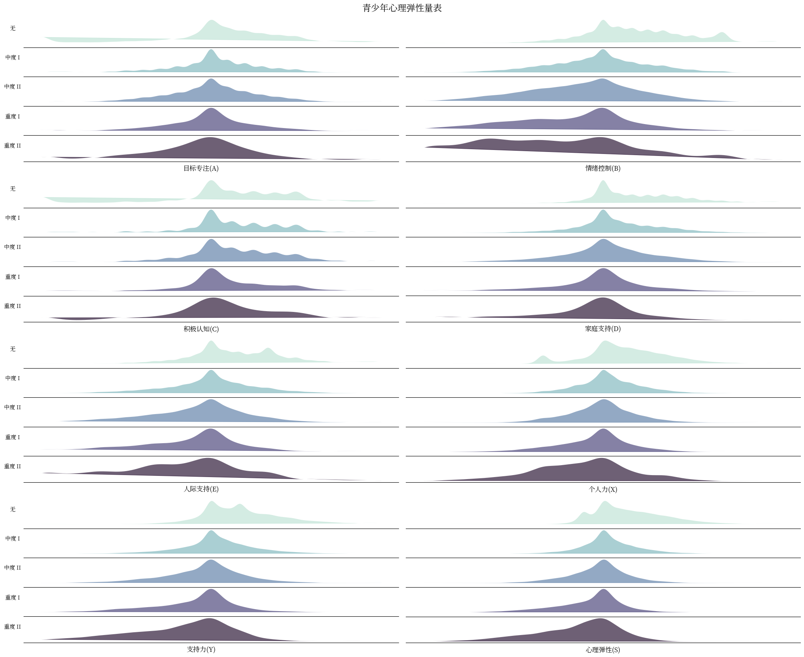
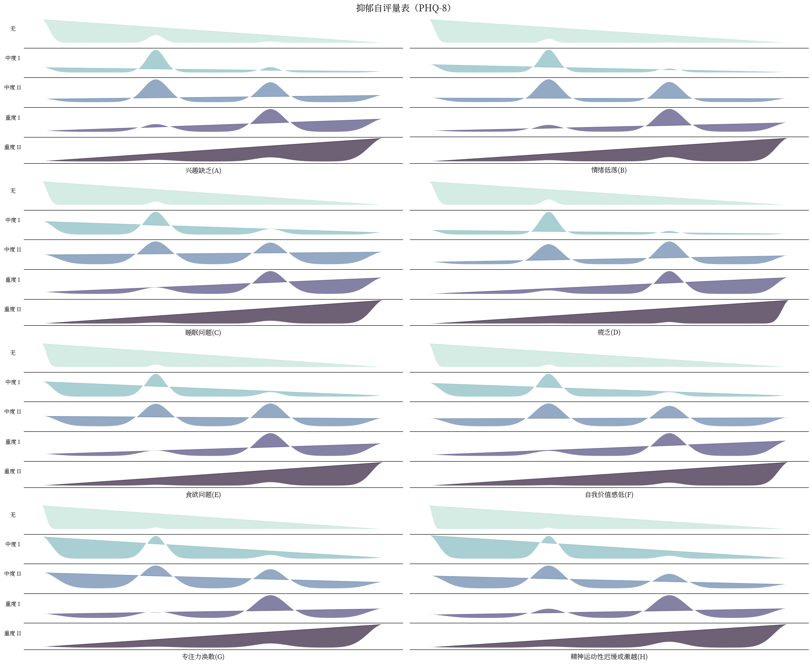
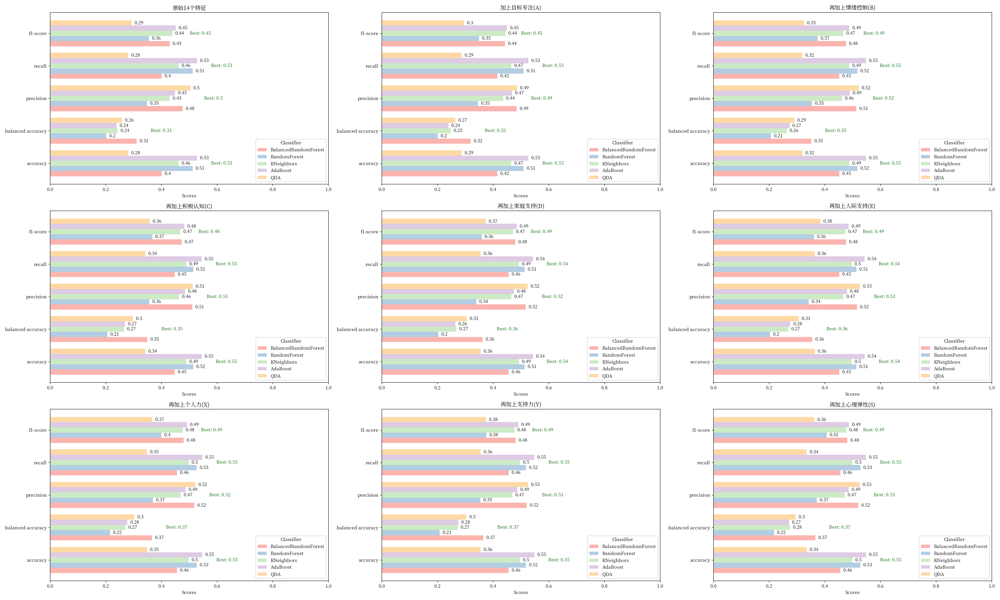
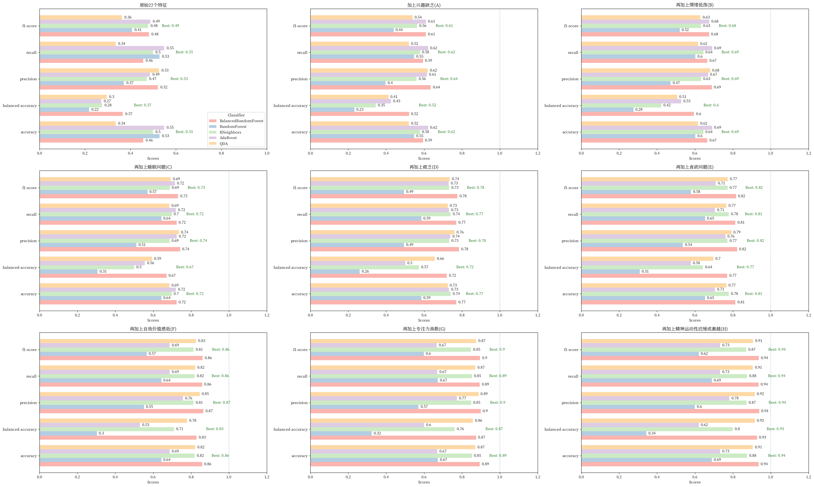

# Recent Work

## Features Distribution and Correlation 

## Features and Targets Correlation

---

---

---

---

---

## Add Features Incrementally

_add_8_trivial_features.png)
---

_add_8_trivial_features.png)
---

---

---
