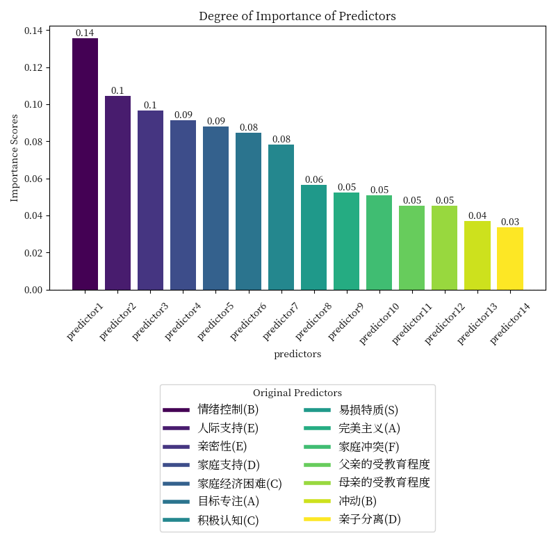

# The result comprison between three and five categories 

1. **The **_left_** side images below are the results of **_three_** categories**
2. **The _right_ side images below are the results of _five_ categories**

## The result of Support Vector Machine

### Accuracy、Precision、Recall、and F1-scores

  
  

### Degree of Importance of Predictors

  
  

## The result of Random Forest

### Cross-validation Accuracy

  
  

### Degree of Importance of Predictors

  
  

## The result of Multi-layer Perceptron

### Accuracy、Precision、Recall、and F1-scores

  
  

### Confusion Matrix 

  
  

